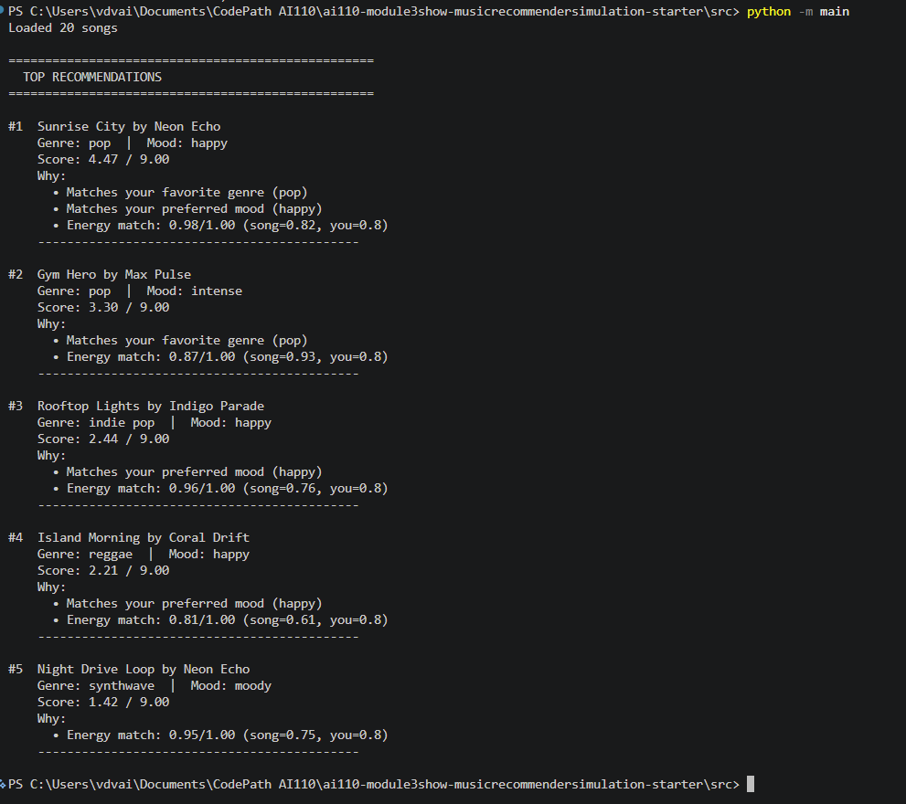

# 🎵 Music Recommender Simulation

## Project Summary

In this project you will build and explain a small music recommender system.

Your goal is to:

- Represent songs and a user "taste profile" as data
- Design a scoring rule that turns that data into recommendations
- Evaluate what your system gets right and wrong
- Reflect on how this mirrors real world AI recommenders

This simulation builds a content-based music recommender that scores songs by how closely their audio features (energy, valence, acousticness, danceability, tempo) match a user's taste profile. It prioritizes explainability — each recommendation includes a plain-language reason — and uses a proximity-based scoring rule rather than treating higher feature values as inherently better.

---

## How The System Works

Real-world recommenders like Spotify and YouTube combine two signals: what similar users listened to (collaborative filtering) and what the song itself sounds like (content-based filtering). At scale they use matrix factorization and deep neural networks across millions of users and songs. This simulation focuses on the content-based side — it builds a taste profile directly from a user's stated preferences and scores every song by how closely its audio features match that profile. The priority is transparency: every recommendation comes with a plain-language explanation of why the song was chosen, something large systems often sacrifice for accuracy.

### Song Features

Each `Song` object stores the following attributes:

| Feature | Type | What it captures |
|---|---|---|
| `id` | int | Unique identifier |
| `title` | str | Song name |
| `artist` | str | Artist name |
| `genre` | str | Musical category (e.g. lofi, pop, rock) |
| `mood` | str | Emotional feel (e.g. chill, happy, intense) |
| `energy` | float (0–1) | Calm vs. intense — highest-weight numeric feature |
| `tempo_bpm` | float | Speed in beats per minute (normalized before scoring) |
| `valence` | float (0–1) | Emotional positivity — sad vs. happy sound |
| `danceability` | float (0–1) | How suitable the song is for dancing |
| `acousticness` | float (0–1) | Acoustic vs. electronic production |

### UserProfile Features

Each `UserProfile` stores the user's stated preferences:

| Field | Type | Role |
|---|---|---|
| `favorite_genre` | str | Used as a categorical bonus in scoring |
| `favorite_mood` | str | Used as a categorical bonus in scoring |
| `target_energy` | float (0–1) | Core numeric anchor for proximity scoring |
| `likes_acoustic` | bool | Shifts acousticness preference high or low |

### Scoring Rule (one song)

Each song receives a score based on proximity to the user's preferences — closer = higher score, not simply louder or faster:

```
score = +2.0  (if song.genre == user.favorite_genre)
      + +1.0  (if song.mood  == user.favorite_mood)
      + 1.5 × (1 - |user.target_energy        - song.energy|)
      + 1.0 × (1 - |user.target_danceability  - song.danceability|)
      + 1.0 × (1 - |user.target_valence        - song.valence|)
      + 1.0 × (1 - |user.target_acousticness   - song.acousticness|)
      + 1.0 × (1 - |user.target_tempo_norm      - song.tempo_norm|)
      + 0.5 × (1 - |user.target_speechiness    - song.speechiness|)
```

**Maximum possible score: ~9.0**

| Component | Points | Why |
|---|---|---|
| Genre match | +2.0 | Strongest structural signal; only 1–3 songs per genre in catalog, so a match is rare and meaningful |
| Mood match | +1.0 | Mood crosses genres (e.g. "chill" appears in lofi and ambient), so it is a weaker but still useful signal |
| Energy ×1.5 | up to 1.5 | Most immediately felt quality — a calm user hearing an intense song is the worst mismatch |
| Danceability, Valence, Acousticness, Tempo ×1.0 | up to 1.0 each | Equal contributors that round out the sonic picture |
| Speechiness ×0.5 | up to 0.5 | Low variance across the catalog; contributes less discriminating power |

Tempo is normalized to 0–1 before scoring using `(bpm - 60) / (168 - 60)` so it stays on the same scale as the other features.

### Sample Output



### Ranking Rule (the list)

After scoring, songs are sorted descending by score and the top `k` are returned. Every song in the catalog is scored before any are cut — this prevents early filtering from skewing the results.

### Potential Biases

- **Genre over-prioritization:** The +2.0 genre bonus can push a poorly matching song (wrong mood, wrong energy) above a song that fits the user's vibe perfectly but belongs to a neighboring genre. A Sunday Acoustic listener might genuinely love a nostalgic country track, but if the catalog only has one folk song it will always outrank everything else by default.
- **Sparse genre penalty:** Profiles whose favorite genre has only one or two songs in the catalog (e.g. `edm`, `folk`) get fewer genre bonus opportunities, making numeric proximity do most of the heavy lifting — the system effectively behaves differently across profiles.
- **Mood label rigidity:** Mood is an exact string match. "Euphoric" and "intense" are emotionally close but score zero for a user who prefers "intense", potentially burying the best workout track in the catalog.
- **No diversity enforcement:** The top-k results can all be from the same genre if that genre scores consistently high, leaving the user with a repetitive list rather than a varied set of recommendations.

---

## Getting Started

### Setup

1. Create a virtual environment (optional but recommended):

   ```bash
   python -m venv .venv
   source .venv/bin/activate      # Mac or Linux
   .venv\Scripts\activate         # Windows

2. Install dependencies

```bash
pip install -r requirements.txt
```

3. Run the app:

```bash
python -m src.main
```

### Running Tests

Run the starter tests with:

```bash
pytest
```

You can add more tests in `tests/test_recommender.py`.

---

## Experiments You Tried

Use this section to document the experiments you ran. For example:

- What happened when you changed the weight on genre from 2.0 to 0.5
- What happened when you added tempo or valence to the score
- How did your system behave for different types of users

---

## Limitations and Risks

Summarize some limitations of your recommender.

Examples:

- It only works on a tiny catalog
- It does not understand lyrics or language
- It might over favor one genre or mood

You will go deeper on this in your model card.

---

## Reflection

Read and complete `model_card.md`:

[**Model Card**](model_card.md)

Write 1 to 2 paragraphs here about what you learned:

- about how recommenders turn data into predictions
- about where bias or unfairness could show up in systems like this


---

## 7. `model_card_template.md`

Combines reflection and model card framing from the Module 3 guidance. :contentReference[oaicite:2]{index=2}  

```markdown
# 🎧 Model Card - Music Recommender Simulation

## 1. Model Name

Give your recommender a name, for example:

> VibeFinder 1.0

---

## 2. Intended Use

- What is this system trying to do
- Who is it for

Example:

> This model suggests 3 to 5 songs from a small catalog based on a user's preferred genre, mood, and energy level. It is for classroom exploration only, not for real users.

---

## 3. How It Works (Short Explanation)

Describe your scoring logic in plain language.

- What features of each song does it consider
- What information about the user does it use
- How does it turn those into a number

Try to avoid code in this section, treat it like an explanation to a non programmer.

---

## 4. Data

Describe your dataset.

- How many songs are in `data/songs.csv`
- Did you add or remove any songs
- What kinds of genres or moods are represented
- Whose taste does this data mostly reflect

---

## 5. Strengths

Where does your recommender work well

You can think about:
- Situations where the top results "felt right"
- Particular user profiles it served well
- Simplicity or transparency benefits

---

## 6. Limitations and Bias

Where does your recommender struggle

Some prompts:
- Does it ignore some genres or moods
- Does it treat all users as if they have the same taste shape
- Is it biased toward high energy or one genre by default
- How could this be unfair if used in a real product

---

## 7. Evaluation

How did you check your system

Examples:
- You tried multiple user profiles and wrote down whether the results matched your expectations
- You compared your simulation to what a real app like Spotify or YouTube tends to recommend
- You wrote tests for your scoring logic

You do not need a numeric metric, but if you used one, explain what it measures.

---

## 8. Future Work

If you had more time, how would you improve this recommender

Examples:

- Add support for multiple users and "group vibe" recommendations
- Balance diversity of songs instead of always picking the closest match
- Use more features, like tempo ranges or lyric themes

---

## 9. Personal Reflection

A few sentences about what you learned:

- What surprised you about how your system behaved
- How did building this change how you think about real music recommenders
- Where do you think human judgment still matters, even if the model seems "smart"

