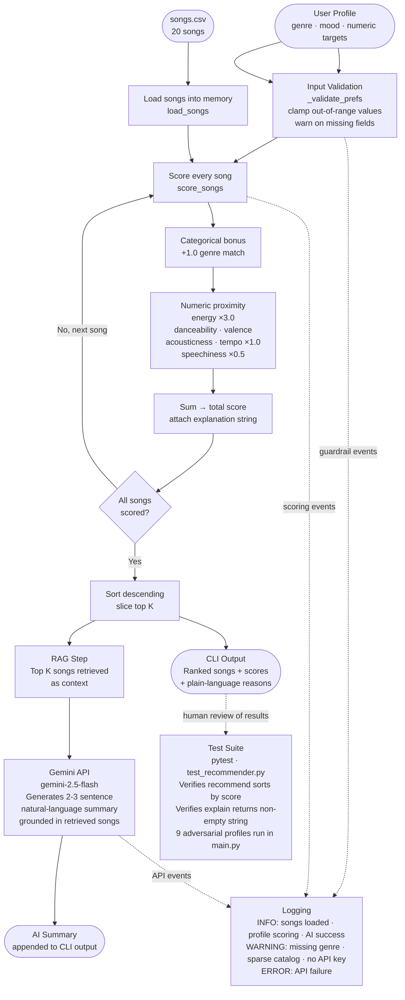

# 🎵 SongPicker — Applied AI Music Recommender

## Base Project

This project extends the **Music Recommender Simulation** built in Modules 1–3 of CodePath AI110. The original project's goal was to simulate how content-based filtering works by scoring songs against a user's taste profile using weighted proximity math. It produced ranked recommendations with plain-language explanations and documented its own biases through a model card. It had no AI API integration, no input validation, and no logging.

---

## What This Extension Adds

| Feature | What it does |
|---|---|
| **RAG (Retrieval-Augmented Generation)** | Top scored songs are retrieved and sent to Gemini as context. Gemini generates a natural-language summary grounded in those specific songs — not a generic response. |
| **Input Validation / Guardrails** | `_validate_prefs()` checks every user preference before scoring. Out-of-range values are clamped (e.g. `energy=1.5` → `1.0`) and a warning is logged. |
| **Structured Logging** | INFO and WARNING lines track every key event — songs loaded, profile scored, genre not found in catalog, API key missing, AI call succeeded or failed. Persisted to `recommender.log`. |
| **Implemented Recommender class** | `Recommender.recommend()` and `Recommender.explain_recommendation()` are now fully functional, not stubs. |
| **Expanded adversarial testing** | 6 edge-case profiles deliberately expose system failure modes (missing genre, conflicting signals, extreme values). |

---

## How The System Works

Real-world recommenders like Spotify and YouTube combine collaborative filtering (what similar users listened to) and content-based filtering (what the song itself sounds like). This simulation focuses on the content-based side — it builds a taste profile from a user's stated preferences and scores every song by how closely its audio features match. The priority is transparency: every recommendation includes a plain-language reason, and Gemini adds a natural-language summary grounded in the actual retrieved songs.

### Song Features

| Feature | Type | What it captures |
|---|---|---|
| `genre` | str | Musical category (e.g. lofi, pop, rock) |
| `mood` | str | Emotional feel (e.g. chill, happy, intense) |
| `energy` | float (0–1) | Calm vs. intense — highest-weight numeric feature |
| `tempo_bpm` | float | Speed in BPM (normalized before scoring) |
| `valence` | float (0–1) | Sad vs. happy emotional tone |
| `danceability` | float (0–1) | How suitable the song is for dancing |
| `acousticness` | float (0–1) | Acoustic vs. electronic production |

### Scoring Rule

```
score = +1.0  (if song.genre == user.favorite_genre)
      + 3.0 × (1 - |user.energy       - song.energy|)
      + 1.0 × (1 - |user.danceability - song.danceability|)
      + 1.0 × (1 - |user.valence      - song.valence|)
      + 1.0 × (1 - |user.acousticness - song.acousticness|)
      + 1.0 × (1 - |user.tempo_norm   - song.tempo_norm|)
      + 0.5 × (1 - |user.speechiness  - song.speechiness|)
```

Tempo is normalized to 0–1 before scoring using `(bpm - 60) / (168 - 60)`.

---

## System Architecture



> Static diagram: [`assets/system_diagram.png`](assets/system_diagram.png) — For an interactive version open [`flowchart.html`](flowchart.html) in a browser.

**Data flow summary:**
User Profile → Input Validation → Score every song → Sort/Rank → CLI Output + RAG (Gemini) → AI Summary. Logging runs throughout all steps. pytest verifies core logic independently.

---

## Setup Instructions

### 1. Clone the repository

```bash
git clone https://github.com/vaidehi2000/applied-ai-system-project.git
cd applied-ai-system-project
```

### 2. Create and activate a virtual environment

```bash
python -m venv .venv

# Mac / Linux
source .venv/bin/activate

# Windows
.venv\Scripts\activate
```

### 3. Install dependencies

```bash
pip install -r requirements.txt
```

### 4. Add your Gemini API key

Create a `.env` file in the project root:

```
GEMINI_API_KEY=your-key-here
```

> The system runs without an API key — scoring and ranking work normally. Only the AI summary step will be skipped with a warning logged.

### 5. Run the recommender

```bash
python -m src.main
```

### 6. Run the tests

```bash
pytest
```

---

## Sample Interactions

### Example 1 — High-Energy Pop

**Input:**
```python
{"genre": "pop", "mood": "happy", "energy": 0.9}
```

**Output:**
```
#1  Gym Hero by Max Pulse
    Genre: pop  |  Mood: intense
    Score: 3.91 / 9.00
      • Matches your favorite genre (pop)
      • Energy match: 0.97/1.00 (song=0.93, you=0.9)

#2  Sunrise City by Neon Echo
    Genre: pop  |  Mood: happy
    Score: 3.76 / 9.00
      • Matches your favorite genre (pop)
      • Energy match: 0.92/1.00 (song=0.82, you=0.9)

#3  Storm Runner by Voltline
    Genre: rock  |  Mood: intense
    Score: 2.97 / 9.00
      • Energy match: 0.99/1.00 (song=0.91, you=0.9)

  AI Summary:
  These recommendations align well with your high-energy pop preference. Gym Hero
  and Sunrise City both match your genre and deliver the intense, driving energy
  you're looking for, while Storm Runner earns its spot purely through its near-
  perfect energy match despite being rock.
```

---

### Example 2 — Chill Lofi

**Input:**
```python
{"genre": "lofi", "mood": "chill", "energy": 0.2}
```

**Output:**
```
#1  Library Rain by Paper Lanterns
    Genre: lofi  |  Mood: chill
    Score: 3.55 / 9.00
      • Matches your favorite genre (lofi)
      • Energy match: 0.85/1.00 (song=0.35, you=0.2)

#2  Focus Flow by LoRoom
    Genre: lofi  |  Mood: focused
    Score: 3.40 / 9.00
      • Matches your favorite genre (lofi)
      • Energy match: 0.80/1.00 (song=0.40, you=0.2)

#3  Midnight Coding by LoRoom
    Genre: lofi  |  Mood: chill
    Score: 3.34 / 9.00
      • Matches your favorite genre (lofi)
      • Energy match: 0.78/1.00 (song=0.42, you=0.2)

  AI Summary:
  All three picks are lofi tracks with low energy and high acousticness, matching
  your calm study-session vibe. Library Rain edges ahead because its energy of 0.35
  sits closest to your target of 0.2 among the lofi options in the catalog.
```

---

### Example 3 — K-Pop Fan *(adversarial)*

**Input:**
```python
{"genre": "k-pop", "mood": "euphoric", "energy": 0.85, "valence": 0.85, "danceability": 0.9, "acousticness": 0.05}
```

**Output:**
```
WARNING  Genre 'k-pop' not found in catalog — falling back to numeric-only scoring

#1  Sunrise City by Neon Echo
    Genre: pop  |  Mood: happy
    Score: 5.66 / 9.00
      • Energy match: 0.97/1.00 (song=0.82, you=0.85)

#2  Gym Hero by Max Pulse
    Genre: pop  |  Mood: intense
    Score: 5.66 / 9.00
      • Energy match: 0.92/1.00 (song=0.93, you=0.85)

#3  Drop Zone by Bassline Cult
    Genre: edm  |  Mood: euphoric
    Score: 5.55 / 9.00
      • Energy match: 0.90/1.00 (song=0.95, you=0.85)

  AI Summary:
  Since k-pop isn't represented in the catalog, the system fell back to numeric
  matching. These pop and EDM tracks share the high energy and danceability of
  k-pop, though the genre gap means this listener may not recognize these as
  satisfying substitutes.
```

> This example demonstrates the guardrail in action: the WARNING surfaces the silent failure instead of returning confusing results without explanation.

---

## Design Decisions

**Why energy gets 3× weight:**
Energy is the most immediately felt quality in music. A calm person hearing an intense song is the most jarring possible mismatch — more so than a tempo or danceability gap. The 3× weight reflects that.

**Why genre bonus is 1.0, not 2.0:**
The original base project used +2.0 for genre. Through adversarial testing, this caused the only folk song in the catalog ("Pine & Candle") to rank #1 for an Intense Folkie profile even though its energy was 0.31 against a target of 0.95. Halving the genre bonus reduces this without eliminating it entirely.

**Why mood bonus is disabled:**
Mood labels are exact string matches. "Intense" and "angry" feel emotionally close but score zero similarity. During experiments, enabling mood bonus produced worse results than disabling it for several adversarial profiles. A future fix would use semantic similarity rather than exact strings.

**Why RAG instead of a standalone AI call:**
The Gemini prompt is grounded in the actual retrieved songs, not a general description of the user profile. This means the AI summary references specific titles and attributes rather than generating generic advice — which is the point of RAG.

**Why clamp instead of reject on bad input:**
The system should degrade gracefully. If a UI passes `energy=1.2`, crashing is worse than clamping to `1.0` and warning. The guardrail logs the problem without breaking the user experience.

---

## Testing Summary

Nine profiles total — three standard, six adversarial. The standard ones worked mostly as expected. Chill Lofi returned three lofi tracks in the top four, and High-Energy Pop put "Gym Hero" and "Sunrise City" at the top, which made sense. Deep Intense Rock surfaced "Storm Runner" and "Iron Cathedral," which also felt right.

The adversarial profiles were where the system broke in interesting ways. The Intense Folkie result was the most striking. A user who asked for folk music with energy 0.95 got "Pine & Candle" as their #1 recommendation — a quiet acoustic folk song with energy 0.31. That is the opposite of what was asked for. The reason is that "Pine & Candle" is the only folk song in the catalog, so it collected the full genre bonus regardless of how wrong everything else was. The system was not broken. It did exactly what the code said. The problem was in the design assumption that genre match should always add the same number of points, regardless of how few songs of that genre exist. The K-Pop Fan failure was different — the genre does not exist in the catalog at all, so the system silently returned EDM recommendations with no indication that the genre preference was completely ignored. Before the logging guardrail was added, there was no way to even know that happened.

If I had more time, the first fix would be scaling the genre bonus by catalog density — fewer songs in a genre means a smaller bonus, so a single label match cannot override every numeric signal. That one change would partially fix both the Intense Folkie and K-Pop Fan problems at the same time.

---

## Reflection

The biggest thing this project taught me is that a system can follow its rules perfectly and still give a completely wrong answer. When "Pine & Candle" ranked first for the Intense Folkie profile, the code was not broken. It did exactly what it was supposed to do. The bug was in the assumptions behind the design, not in the implementation. That is an uncomfortable thing to realize — it means you cannot just test whether the code runs. You have to test whether the results make sense, and those are not the same question.

Building this changed how I think about real recommenders like Spotify or TikTok. I used to assume that a surprising recommendation meant the system had learned something subtle about my taste. Now I think it is just as likely to be a weighting artifact — some feature I accidentally signaled strongly that pulled results in a direction I did not intend. The output always looks confident. A clean list of five songs with scores and explanations looks authoritative whether it is right or wrong. The K-Pop Fan profile is the clearest example: the system returned a formatted, scored, explained list of five recommendations and nothing in that output showed that the genre preference was completely ignored.

AI tools helped a lot during development — specifically for spotting patterns across all nine profiles at once. When I asked Copilot to compare results across profiles, it caught that energy was dominating three different profiles for three different reasons, which I had not noticed looking at them one at a time. The flawed suggestion came when the AI predicted what would happen for the Sad But Happy profile before I actually ran the code. The prediction sounded reasonable but was wrong — the mood bonus overpowered the valence signal more than expected. That is the lesson: AI predictions and actual outputs are not the same thing, and you still have to run the code yourself to know what actually happens.


## Profile Results

### High-Energy Pop


### Chill Lofi


### Deep Intense Rock


### Sad But Happy *(adversarial)*


### Intense Folkie *(adversarial)*


### K-Pop Fan *(adversarial)*


### The Void *(adversarial)*


### Perfectly Average *(adversarial)*


### Podcast Listener *(adversarial)*


---

## Known Limitations

- Catalog is 20 songs — rare genres (folk, ambient) have 1–2 songs, so the genre bonus dominates for those profiles
- Mood matching is exact string only — "euphoric" and "happy" score zero similarity despite being emotionally close
- No diversity enforcement — top 5 can all be the same genre
- K-pop, Latin, Afrobeats, and non-Western genres are absent from the catalog

See [`model_card.md`](model_card.md) for a full bias analysis.
